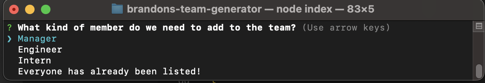

# Employee Team Generator(module 10)

## Description
  This application prompts a user to enter information regarding employees based on their roles, and generates cards on an HTML page that displays the employee information.

# Table of Contents

- [Installation](#installation)
- [Usage](#usage)
- [License](#license)
- [Screenshot](#screenshot)
- [Walkthrough](#walkthrough)
- [Credits](#credits)
- [Contributions](#contributions)
- [Tests](#tests)

## Installation
  Clone the repository then run the application in node.
## Usage
  One could use this to create a neatly formatted list of all the employees in their roster.

## License: ISC 

License link: https://opensource.org/license/isc-license-txt/
## Screenshot

## Walkthrough
https://www.youtube.com/watch?v=STSZTfKVKj8&ab_channel=BrandonWing
## Credits
https://github.com/rudyxwhite

## Contact Information
  brandonrwing98@gmail.com
       
## Contributions
  No contributions allowed at this time.

## Tests
  Tests for the application are within the __tests__ directory in the reposition.
